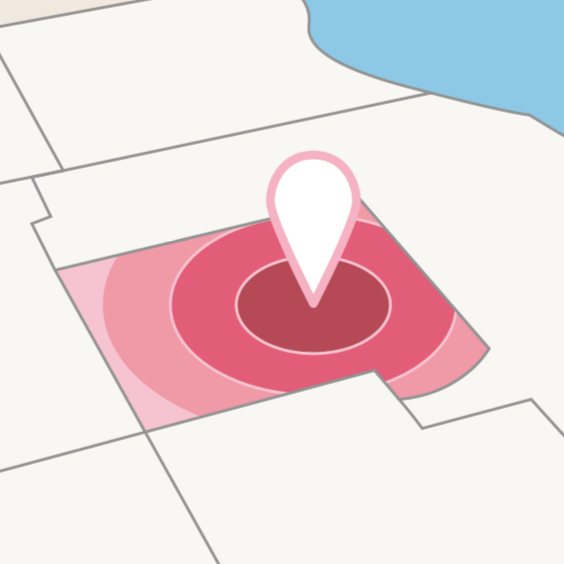

# geopresence

The main idea behind this work is to create a geospatial index that runs on IoT/low-power devices. Location-based services, weather tracking, mapping, and GIS are all applicable domains. For a simplistic example, imagine air quality and weather monitoring devices placed on the streetlights in a city; rather than querying weather.com for the current weather in the Presidio or Mission District, why not just ask the streetlight across the street from the restaurant you're going to?

Here is some previous work in this area:

* https://www.cs.usfca.edu/~mmalensek/publications/malensek2013polygon.pdf
* https://www.cs.usfca.edu/~mmalensek/publications/malensek2014geometry.pdf

This approach works fine for small spatial regions, but begins to slow down when (1) resolution is increased, and (2) the size of the bitmaps and/or queries becomes too large. It also has no mechanism for dealing with high density points.

Info about bitmaps: https://en.wikipedia.org/wiki/Bit_array

The previous approaches use EWAH compressed bitmaps. We can likely leverage the newer, better [Roaring Bitmaps](https://roaringbitmap.org) to already gain an advantage over the previous approach. We will also implement this project in C so it will be more lightweight than the Java-based implementation.

When a particular grid cell gets hit with lots of storage requests, we will create a new, higher-resolution grid to represent that cell. To do this, we can use [Count Min](https://en.wikipedia.org/wiki/Count–min_sketch) or perhaps even better [HyperLogLog++](https://en.wikipedia.org/wiki/HyperLogLog).

# Implementation

The project implementation will be broken down into several tasks. See the following sections for details.

## Task 1: Loading Data and Creating a Spatial Grid

We can begin with the geohash dataset from the NOAA [North American Mesoscale Forecast System](https://www.ncei.noaa.gov/products/weather-climate-models/north-american-mesoscale). This has many points that overlap, since weather is recorded for particular areas across a grid. We will need to:

* Estimate the density of data already held for the geohash
* Search for sub geohash or create it if the low resolution hash is appropriately dense
* Convert geohashes to lat, lon points
* Map lat, lon points to grid cells (x, y coordinates)
* Map this grid to a bitmap

The original Java implementation uses a 'base geohash' to determine the spatial range of the geogrid bitmap. This is a large, low-resolution area (e.g., `9x`) that helps conversion to x,y coordinates.

### Benchmarks

Since we're targeting IoT deployments, we will test on a Raspberry Pi.

* Loading data: what is the speed difference in loading the data between the C and Java versions? We should load the data twice, one to initially populate the bitmap, and again to test reinsertion (in the 2nd pass, no new data should be added). 
* Memory consumption: use valgrind / visualvm to record mem usage. How many records can we store on a single Pi?
* Varying insertion sizes: the Java implementation stores incoming points in a sorted map and then inserts them before servicing a query. This helps avoid issues with out-of-order insertions with EWAH. However, Roaring Bitmaps have no such limitation so we can insert a single point at a time or several. For this benchmark, we will vary the insertion size and measure speed (it is likely faster to insert many points at once, but there should be a point of diminishing returns)

### Benchmark Status

Implementations:

- [X] Data load implementation (C + Java)

- [X] Double pass data load implementation (C + Java)

- [X] Random insertion implementation (C + Java)

- [X] Data load and query (C + JAVA)

Results Collected:

- [X] Single-pass data load timing on RPi 3
 
- [X] Double-pass data load timing on RPi 3
 
- [X] OpenJDK 8 vs Oracle JDK 8, also OpenJDK 11
 
- [X] Single-pass memory consumption
 
- [X] Double-pass memory consumption

- [ ] ~~Batched insertion benchmark~~

- [X] Random insertion benchmark - OpenJDK 11 Pending

### Queries in C

Before describing functionality, it will be helpful to clearly define terminology. 

The `grid` is a hashmap of geohashes to `geode`. 

A `geode` is a struct containing a bitmap representation of where data is in the spatial range.

Both the `grid` and the `geode` can be queried with a set of latitude longitude coordinates representing a polygon. 

[Roaring bitmaps](https://github.com/RoaringBitmap/CRoaring) are used to index data for each `geode`.

The algorithm for drawing polygons was taken from [libgd](https://github.com/libgd/libgd) and modified for [roaring bitmaps](https://github.com/RoaringBitmap/CRoaring).

##### Grid queries

There is functionality for determining

1. *Which* geodes in the grid are contained in the query.

##### Geode queries

Any part of the query that lies outside of the spatial range of the geode is clipped.

There is functionality for determining 

1. If *any* bits set in the `geode`'s bitmap are contained in the query. 
2. *Which* bits in the `geode`'s bitmap are contained in the query. 

These queries were benchmarked against [RTrees](https://github.com/tidwall/rtree.c) using geodes of 3 different levels of bit precision.

Each point on the graph is an average of 100 runs.

## Task 2: Probabilistic Point Density Estimation

Evaluate [Count Min](https://en.wikipedia.org/wiki/Count–min_sketch) and [HyperLogLog++](https://en.wikipedia.org/wiki/HyperLogLog) for estimating the amount of points stored in each grid cell.

After a warm-up period, if a particular point has a disproportionate amount of unique values then it should be split off into its own bitmap.

How to determine "disproportionate?"
* Coefficient of variation
* One or two std devs from mean?

How to integrate into query pipeline? Use point-in-polygon algorithm to determine if the sub-bitmap should be checked?

### Naive Solution

* For now it is implemented to look at a particular geodes "load factor", (1 - estimated_unique/total). 
* If unique points are not disproportionate to the total number of points, then the load factor is low.
* Geodes are split if a load factor of 60% is breached.

Each geode has one HLL and a list of pointers to sub geodes. Once a load factor of 60% is breached, data will be added to sub geodes instead of the main geode. Currently implemented 
as a psuedo tail-recursive solution (Once the correct sub geode is found/created, data is added to it and then stack frames are popped but nothing executes on the way back down the stack). 
Checking the HLL everytime a data point is added also greatly slows down the insertion benchmarks ~1000%. This should still be faster than the Java version but has not been graphed.

TODO: All sub geodes of a geode's tree should be queried for index locations. Intersections would require that all sub geodes are queried as well. Currently only the low resolution bitmap is being queried.
TODO: The benchmarks for random insertion and querys use geode_add_xy. Only geode_add_geohash does splitting of grid cells and it uses geode_add_xy once appropriate sub geode is found. All benchmarks should use geohashes instead of (x,y) points

##### Pros 

* Easy to implement
* Easy to understand

##### Cons

* Potential to create unnecessary geodes since each geode only has 1 HLL and splits all incoming data into sub geodes after the load factor is breached.
* For example, all data in a geode tracking 9x goes into the sub geode 9xt and eventually the load factor of 9x is breached. Now if data from 9xj is put into the 9x geode, the algorithm will still split 9xj into its own subgeode even though 9xj is not dense. 
* Not yet recursive, but likely that this solution can be implemented recursively easily.

## Task 3: OpenStreetMap Data

The case study here will be using OSM data to compare against the plain old gridded NOAA data. We should be able to achieve much better query performance compared to GeoGrids because we can distinguish density. (See: SF vs Reno)

## Task 4: Paper
Due date: 4/20/2022
...
